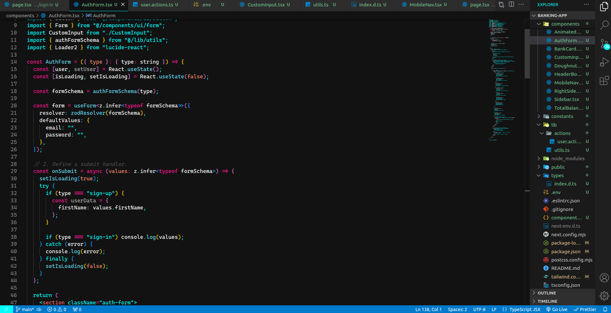

A Visual Studio Code theme for the dark theme lovers out there. Inspired by the Electric Night Theme of Firefox. It's the minimalist theme you are looking for!

### Installation

- Install Visual Studio Code
- Launch Visual Studio Code
- Choose Extensions from menu
- Search for `electric-night`
- Click Install to install it
- Click Reload to reload the Code
- From the menu bar click: Code > Preferences > Color Theme > Electric Night

